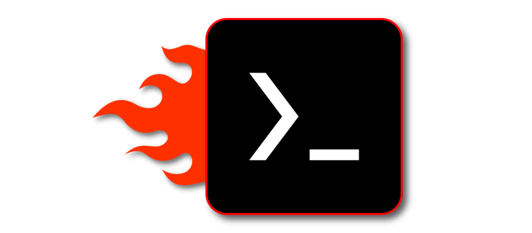

## About

`Termux-box` is a script to install preconfigured rootfs with [Box86](https://github.com/ptitSeb/box86), [Box64](https://github.com/ptitSeb/box64), [Wine](https://www.winehq.org/) and [DXVK](https://github.com/doitsujin/dxvk) installed. It allows you to run x86 and x86_64 windows programs (such as games) on Android using [Termux](https://github.com/termux/termux-app).

`Termux-box` is not Box64Droid neither Box4Droid.

## Installation
After installation the start command in termux is `termux-box`

Download and install
[Termux](https://f-droid.org/en/packages/com.termux),
[Termux-X11](https://raw.githubusercontent.com/olegos2/termux-box/main/termux-x11-arm64-v8a-debug.apk)

Open termux and paste command

`curl -s -o x https://raw.githubusercontent.com/olegos2/termux-box/main/install && chmod +x x && ./x`

#
Big thanks to Hugo for help.

[MishkaKolos Discord](https://discord.gg/ZAQnZzbCXq)

## Device support
### Android
* `Android 10+` — for root users
* `Android 11+` — for non-root users
### Render
* Snapdragon with Adreno 6xx or Adreno 7xx — for Turnip + Zink / Turnip+DXVK with better speed.
* Qualcomm/Mediatek/Exynos — for VirGL

## Features
* `Termux-box` has automatic updates, so you don't have to reinstall it so often.
* TFM works a lot faster with custom wine.
* The most lightweight rootfs.
* `Proot` which is faster than proot-distro.
* `Chroot` with working VirGL for root users
* VirGL server with dxtn support (termux virgl doesn't have this). Mesa-VirGL 18.3.0, 19.1.8, 22.1.7.
* `Turnip` with adreno 610 and 7xx support. `Mesa-zink-11.06.22` built from alexvorxx repo which is faster and has better compatibility. `D8VK + DXVK + VKD3D` and `WineD3D`.
* `Prefix-tweaks` script that automatically installs DirectX, 7-Zip, various registry fixes, better taskmgr and notepad. Custom theme, better fonts which give a lot better look compared to default wine prefix. Better icons. E:\ (Android/data/com.termux/files/Download folder) for faster performance without having to copy games to C:\ drive
* Experimental `wine-tweaks` script that automatically installs downloaded wine, customizes it for better TFM speed and reduces size

## Third party applications

[Box4Droid](https://github.com/Herick75/Box4Droid)

[Box64](https://github.com/ptitSeb/box64) MIT license

[Box86](https://github.com/ptitSeb/box86) MIT license

[Proot](https://github.com/termux/proot) GPL-2.0 license

[DXVK](https://github.com/doitsujin/dxvk) Zlib license

[DXVK-ASYNC](https://github.com/Sporif/dxvk-async)

[DXVK-GPLASYNC](https://gitlab.com/Ph42oN/dxvk-gplasync)

[VKD3D](https://github.com/lutris/vkd3d) LGPL-2.1 license

[D8VK](https://github.com/AlpyneDreams/d8vk) Zlib license

[Termux-app](https://github.com/termux/termux-app) GPLv3 license

[Termux-x11](https://github.com/termux/termux-x11) GPL-3.0 license

[Wine](https://wiki.winehq.org/Licensing)

[Mesa](https://docs.mesa3d.org/license.html) MIT license

[mesa-zink-11.06.22](https://github.com/alexvorxx/mesa-zink-11.06.22)
